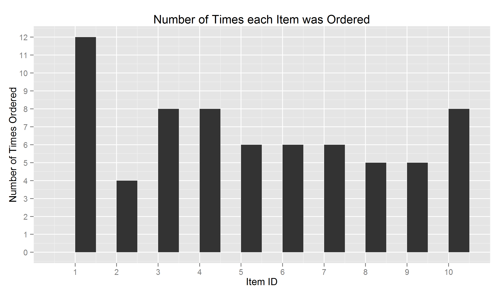

Project 1 Guidelines:
```
cs329e Data Visualization R Project 1

1. Create a GitHub Repository named DV_RProject1 (you only need one per project team)

2. Clone the project into a DV_RProject1 folder in your Data Visualizaiton Folder, all of the project code should go into this repository.
Create an RStudio DV_RProject1 Project (this is where you will do your development)

3. The repository shoud have the following structure:
  00 Doc
  01 Data
  02 Visualizations
  
4. Using KnitR, build an html file that documents the steps to reproduce your project . Use this html file to present a visual story about your data and what you discovered about your data using visualization techniques.

5. Build data frames for each of the 4 tables in the Orders Schema. Use the following RestfulReL call for these:

df <- data.frame(eval(parse(text=substring(getURL(URLencode('http://129.152.144.84:5001/rest/native/?query="yourQuery"'), httpheader=c(DB='jdbc:oracle:thin:@129.152.144.84:1521/PDB1.usuniversi01134.oraclecloud.internal', USER='DV_ORDERS', PASS='orcl', MODE='native_mode', MODEL='model', returnFor = 'R', returnDimensions = 'False'), verbose = TRUE), 1, 2^31-1))))

6. Display these data frames in the KnitR document.

7. Produce an interesting plot for each data frame.

8. Using the following query
select * from orders o join customers c on o.customer_id = c.customer_id join order_details d on o.order_id = d.order_id join items i on d.item_id = i.item_id

9. Build a data frame for the entire data set.

10. Produce the following plots and document the R used to produce them.
```

Build data frames for each of the 4 tables in the Orders Schema using RestfulRel calls.
```{r}
library('RCurl')
source("../01 Data/create_data_frames.R", echo = TRUE)
dfC #customers data frame
dfI #items data frame
dfO #orders data frame
dfOD #order details data frame
```
Plot of Number of customers vs. Customer city to represent Popularity by city

Plot of average unit price per artist

Plot of number of times each item was ordered by item ID

Plot of ordered date vs. shipped date by order ID


Build a data frame from the entire set using join query
```{r}
source("../01 Data/create_join_df.R", echo = TRUE)
dfJ #join data frame
```

Using the join data frame, plot order date vs. shipped date in each state.
```
sp1 <- ggplot(dfJ, aes(x=ORDER_DATE, y=SHIPPED_DATE)) + geom_point(aes(color = UNIT_PRICE))
sp1 <- sp1 + facet_wrap(~CUSTOMER_STATE, ncol=4)
sp1 + coord_fixed()
ggsave(file="Question101.png", path='00 Doc')
```


```
sp2 <- ggplot(dfJ, aes(x=ORDER_DATE, y=SHIPPED_DATE)) + geom_point(aes(color = TITLE))
sp2 <- sp2 + facet_wrap(~CUSTOMER_STATE, ncol=4)
sp2 + coord_fixed()
ggsave(file="Question102.png", path='00 Doc')
```


```
sp3 <- ggplot(dfJ, aes(x=ORDER_DATE, y=SHIPPED_DATE)) + geom_point(aes(color = ARTIST))
sp3 <- sp3 + facet_wrap(~CUSTOMER_STATE, ncol=4)
sp3 + coord_fixed()
ggsave(file="Question103.png", path='00 Doc')
```
